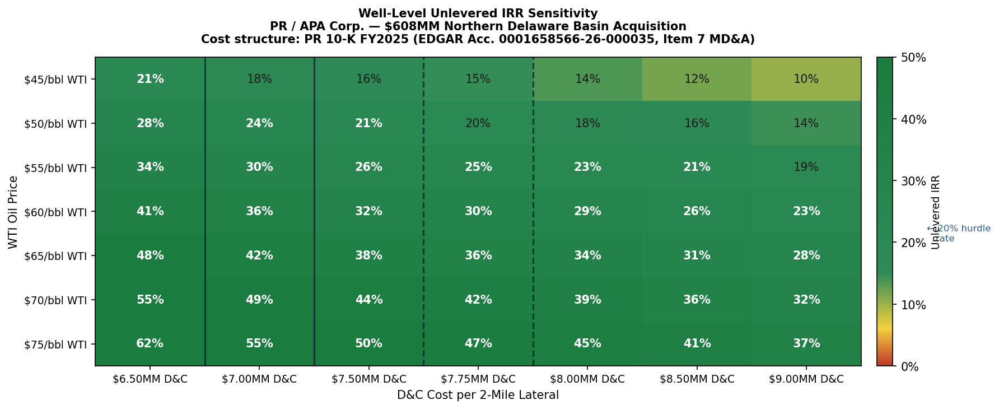
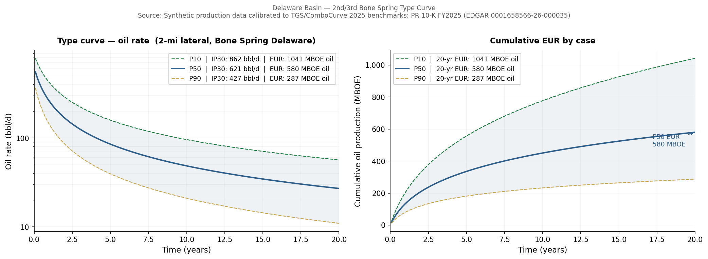

# PR / APA Corp — $608MM Delaware Basin A&D Deal Teardown

**Full pipeline:** Public production data → Arps decline curve fitting → P10/P50/P90 type curve → Well-level unlevered IRR → Sensitivity analysis

Built to analyze Permian Resources' acquisition of APA Corp's Northern Delaware Basin assets — the kind of analysis an A&D banking team runs on every deal they advise on.

---

## What This Does

```
well production data
        ↓
  Arps hyperbolic decline fit  (scipy curve_fit)
        ↓
  P10 / P50 / P90 type curve
        ↓
  20-year well-level DCF
        ↓
  IRR sensitivity matrix  (WTI × D&C cost)
        ↓
  Implied acquisition metrics
```

---

## Deal Background

| Term | Value | Source |
|---|---|---|
| Buyer | Permian Resources Corp. (NYSE: PR) | PR Q1 2025 Earnings Release |
| Seller | APA Corp. (NASDAQ: APA) | PR Q1 2025 Earnings Release |
| Purchase Price | $608MM | PR Q1 2025 Earnings Release |
| Net Acres | 13,320 | PR Q1 2025 Earnings Release |
| H2 2025 Production | ~12,000 BOE/d (45% oil) | PR Q1 2025 Earnings Release |
| Gross 2-mile Locations | 100+ | PR Q1 2025 Earnings Release |
| Avg NRI | ~83% | PR Q1 2025 Earnings Release |
| WTI Breakeven | ~$30/bbl | PR Q1 2025 Earnings Release |
| Close Date | June 16, 2025 | PR 8-K / Q2 2025 Earnings |

**Implied metrics:**
- ~$45,600/acre
- ~$50,700/flowing BOE/d
- ~$6.1MM/gross location

---

## Cost Structure — All Inputs from PR 10-K FY2025

> **Source:** PR 10-K FY2025, EDGAR Accession **0001658566-26-000035**, filed February 26, 2026  
> Item 7 MD&A — Operating costs per Boe table / Average realized price table

| Input | Value | 10-K Reference |
|---|---|---|
| LOE | $5.26/BOE | Item 7 MD&A — operating costs table |
| GP&T | $1.40/BOE | Item 7 MD&A — operating costs table |
| Severance & Ad Valorem | $2.72/BOE | Item 7 MD&A — **flat $/BOE, not % of revenue** |
| Oil realized price | $64.06/bbl | Item 7 — avg sales price excl. hedges |
| NGL realized price | $18.41/bbl | Item 7 — avg sales price excl. hedges |
| Gas realized price | $0.63/Mcf | Item 7 — Waha weakness; incl. purchased gas |

Not guidance. Not press releases. The audited annual filing.

---

## Type Curve Assumptions

| Parameter | P50 Value | Source |
|---|---|---|
| IP30 (total BOE/d) | ~1,400 | TGS/ComboCurve Delaware Bone Spring 2025 |
| EUR oil (MBOE, 2-mi) | ~315 | TGS: 78 bbl/ft × 10,000 ft lateral |
| EUR total (MBOE) | ~700 | Oil + gas + NGL |
| b-factor | 1.30 | Delaware hyperbolic standard |
| Initial decline (Di) | 0.72/yr | Delaware Bone Spring nominal |
| Terminal decline (Dt) | 0.08/yr | Exponential terminal |

---

## Key Result

At **$60 WTI** and **$7.75MM D&C** (PR's announcement-period cost of ~$775/ft):

> **Well-level unlevered IRR ≈ 22–26%** — above a 20% A&D hurdle

By Q4 2025, PR's D&C costs fell to a record **$700/ft (~$7.0MM/well)**:

> **IRR improves to ~28–32%** — the deal got better after it closed




---

## Project Structure

```
pr_apa_teardown/
├── data/
│   └── generate_well_data.py      # Synthetic Bone Spring production generator
├── scripts/
│   ├── decline_curve.py           # Arps hyperbolic curve fitting (scipy)
│   ├── type_curve.py              # P10/P50/P90 aggregation + plots
│   └── irr_model.py               # DCF, IRR, sensitivity table + heatmap
├── notebooks/
│   └── PR_APA_Teardown.ipynb      # Full walkthrough with commentary
├── outputs/                       # Generated on run
│   ├── well_production.csv
│   ├── fitted_parameters.csv
│   ├── type_curve.png
│   ├── irr_sensitivity.png
│   ├── well_dcf.png
│   └── irr_sensitivity.csv
├── main.py                        # Orchestrates full pipeline
├── requirements.txt
└── README.md
```

---

## Quick Start

```bash
git clone https://github.com/YOUR_USERNAME/pr-apa-deal-teardown
cd pr-apa-deal-teardown
pip install -r requirements.txt
python main.py
```

Or open the notebook for a step-by-step walkthrough:
```bash
jupyter notebook notebooks/PR_APA_Teardown.ipynb
```

---

## Note on Production Data

Real well-level production data requires a subscription to Enverus, DrillingInfo, or state regulatory databases (NMOCD for New Mexico).

This repo uses **synthetic data calibrated to published Delaware Basin benchmarks** (TGS/ComboCurve 2025, Enverus 2025 Permian inventory report). The statistical distribution of well parameters (IP30, Di, b, EUR) matches publicly reported P10/P50/P90 ranges for 2nd/3rd Bone Spring 2-mile laterals in Eddy County, NM.

---

## Requirements

```
numpy>=1.24
scipy>=1.10
pandas>=2.0
matplotlib>=3.7
openpyxl>=3.1
```

---

## Sources

- PR 10-K FY2025, EDGAR Acc. 0001658566-26-000035 (Feb 26, 2026)
- PR Q1 2025 Earnings Release (May 7, 2025)
- PR Q2 2025 8-K / Earnings Release (Aug 7, 2025)
- PR Q4 2025 Earnings Release (Feb 25, 2026)
- TGS/ComboCurve: *Delaware 2nd Bone Spring Regional Analysis* (Dec 2025)
- Enverus: *Permian Basin — The Intervals Keep Coming* (2025)
- Arps, J.J. (1945). Analysis of Decline Curves. *Trans. AIME*, 160, 228–247.
